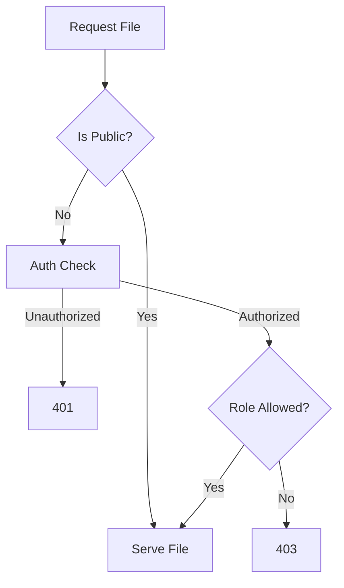

# File System Module — API Documentation

## Base Path

```
/api/files
```

---

## Upload File

### `POST /upload`

Uploads a file and optionally links it to a resource.

### Headers

```http
Authorization: Bearer <token>
Content-Type: multipart/form-data
```

### Form Data Order (IMPORTANT)

> Metadata **must be appended before the file**
> (required for backend routing logic)

| Field          | Type          | Required |
| -------------- | ------------- | -------- |
| `relatedType`  | String        | No       |
| `relatedId`    | String        | No       |
| `isPublic`     | Boolean       | No       |
| `allowedRoles` | JSON / String | No       |
| `file`         | File          | Yes      |

---

### Response — `201 Created`

```json
{
  "success": true,
  "data": {
    "id": "01ARZ3NDEKTSV4RRFFQ69G5FAV",
    "fileName": "01ARZ3NDEKTSV4RRFFQ69G5FAV.png",
    "originalName": "profile.png",
    "mimeType": "image/png",
    "size": 1024,
    "isPublic": true
  }
}
```

---

## View / Download File

### `GET /:id`

Streams file contents.

### Behavior

| File Type   | Result          |
| ----------- | --------------- |
| Image / PDF | Inline preview  |
| Other       | Forced download |

### Cache Headers

* **Public**

  ```
  Cache-Control: public, max-age=3600
  ```
* **Private**

  ```
  Cache-Control: no-store
  ```

---

## Access Control Flow



---

## Internal Service API

### `processUpload(file, options)`

* Creates file record
* Links to resource
* Handles single-file replacement

---

### `linkFile({ fileId, relatedType, relatedId })`

Attaches existing file to another resource.

---

### `unlinkFile(fileId, relatedType, relatedId)`

* Removes association
* Deletes file if orphaned

---

## Security Considerations

* MIME type whitelist
* DB-driven file paths (no traversal)
* RBAC enforced at stream time
* `super_admin` bypasses role checks
