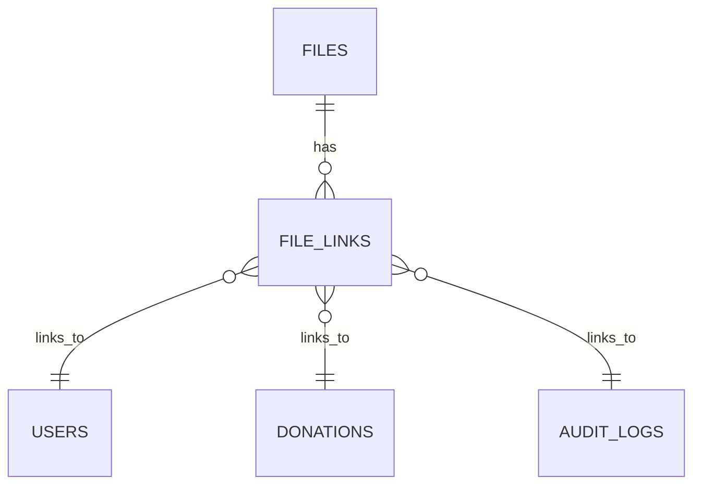

# File System Module — Database Documentation

## Overview

The File System uses a **many-to-many** design to decouple physical file storage from application resources.
Files are stored once and linked to multiple domain entities using a junction table.

---

## Tables

### `files` — Physical File Asset

Represents the actual file stored on disk.

| Column         | Type        | Description                           |
| -------------- | ----------- | ------------------------------------- |
| `id`           | ULID / UUID | Primary identifier                    |
| `path`         | String      | Absolute server file path             |
| `originalName` | String      | Original uploaded filename            |
| `mimeType`     | String      | MIME type                             |
| `size`         | Integer     | File size in bytes                    |
| `isPublic`     | Boolean     | Publicly accessible flag              |
| `allowedRoles` | JSON        | Roles allowed to access private files |
| `createdAt`    | Timestamp   | Upload time                           |

---

### `file_links` — Association Table

Links files to application resources.

| Column        | Type            | Description                             |
| ------------- | --------------- | --------------------------------------- |
| `id`          | UUID            | Primary key                             |
| `fileId`      | FK → `files.id` | Linked file                             |
| `relatedType` | String          | Table name (`users`, `donations`, etc.) |
| `relatedId`   | String          | Row ID of related resource              |
| `createdAt`   | Timestamp       | Link creation time                      |

---

## Relationships (ERD)

---

## Orphan Cleanup Strategy

* Files are **never deleted directly**
* On unlink:

  1. Count remaining `file_links`
  2. If count === 0:

     * Delete DB record
     * Delete physical file from disk
* Executed inside a **database transaction** to prevent race conditions

---

## Single-File Resources

Some resources (e.g. user profile pictures) are **single-file only**.

Behavior:

* New upload automatically:

  * Unlinks old file
  * Deletes it if orphaned

---

## Design Guarantees

* No duplicate file storage
* Safe deletion
* Flexible linking
* Future-proof for new resource types
