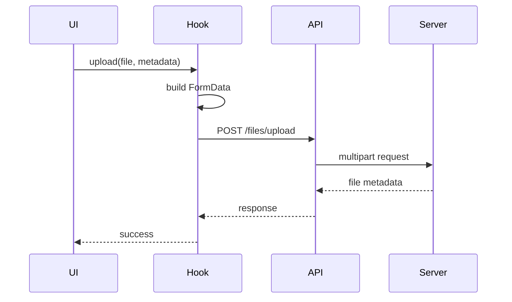

# File System Module — Frontend Documentation

## Overview

The frontend integrates with the File System via:

* A reusable `useFileUpload` hook
* Axios-based API client
* Direct file streaming via ``

---

## `useFileUpload` Hook

### Purpose

* Encapsulates upload state
* Enforces correct FormData ordering
* Centralizes error handling

### Usage

```jsx
const { upload, uploading, error } = useFileUpload();

await upload(file, {
  relatedType: 'users',
  relatedId: user.id,
  isPublic: true
});
```

---

### Upload Flow



---

## Displaying Files

### Images / PDFs

```jsx

```

Authentication cookies are included automatically via Axios (`withCredentials: true`).

---

## Handling Resource Responses

### Single File (Flattened)

```json
{
  "profilePicture": {
    "id": "...",
    "fileName": "..."
  }
}
```

### Multiple Files

```json
{
  "attachments": [
    { "id": "A..." },
    { "id": "B..." }
  ]
}
```

---

## Realtime Integration

Files work seamlessly with `useRealtimeResource`:

* File metadata updates propagate via store
* UI re-renders automatically when linked/unlinked
* No manual refresh required

---

## Axios Integration

### Upload Method

```js
uploadFile: (formData) =>
  axios.post("/files/upload", formData, {
    headers: { "Content-Type": "multipart/form-data" }
  })
```

### File URL Helper

```js
getFileUrl: (fileId) => `${API_BASE_URL}/files/${fileId}`
```

---

## Best Practices

* Always store file **IDs**, never paths
* Let backend handle permissions
* Use lazy loading for images
* Do not cache private files manually

---

## Summary

The frontend treats files as **streamed resources**, not static assets, ensuring:

* Security
* Realtime compatibility
* Zero duplication
* Clean UI logic
